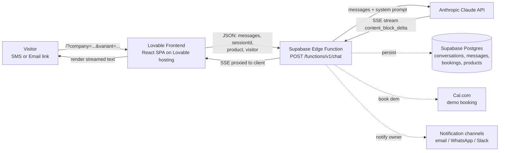

# 01 — Architecture

## Product overview

A single-page, mobile-first chat assistant that engages prospects who click through from GENERA8's outbound SMS or email campaigns. The visitor lands on a personalized chat (e.g. "Hi {Dealer} — let's talk LotManager"), an opening message is sent silently to the model, and the assistant streams replies. Booking a demo is an explicit goal of the conversation.

## Primary user flows

Both flows depend on URL parameters being present — the page renders an "Invalid access" screen otherwise (see `src/pages/Index.tsx:178-203`).

**SMS visitor (variant starts with `web`)**

1. User taps SMS link → lands on `/?company=...&variant=web1` (or `web2`, `web3`).
2. URL params parsed and sanitized (`src/pages/Index.tsx:45-57`).
3. Hidden initial message: `Hi, I'm from {dealer}. I clicked through from the SMS about LotManager.` (`src/pages/Index.tsx:145-153`). Channel is `SMS` because variant starts with `web`.
4. Edge Function streams Claude's first reply.

**Email visitor (variant `1`, `2`, `3`)**

1. User clicks email CTA → lands on `/?company=...&variant=1` (or `2`, `3`).
2. Same parsing logic.
3. Hidden initial message uses channel `email` (variant does not start with `web`, see `src/pages/Index.tsx:145`).
4. Streamed reply.

⚠️ **TO CONFIRM** — The mapping of variant codes to specific campaign steps (web1/2/3 = SMS step number, 1/2/3 = email step number) is described in user-provided context but is **not** encoded in the frontend; the frontend only branches on `startsWith("web")`. Step-level differentiation, if any, must happen server-side in the Edge Function (source not in repo).

## Tech stack

Versions from `package.json`:

| Layer | Tech | Version |
|---|---|---|
| Framework | React | ^18.3.1 |
| Build | Vite | ^5.4.19 |
| Language | TypeScript | ^5.8.3 |
| Styling | Tailwind CSS | ^3.4.17 |
| UI primitives | Radix UI + shadcn/ui | various |
| Routing | react-router-dom | ^6.30.1 |
| Data fetching | @tanstack/react-query | ^5.83.0 (provider mounted, not actively used in chat) |
| Backend SDK | @supabase/supabase-js | ^2.103.0 |
| Forms | react-hook-form + zod | ^7.61.1 / ^3.25.76 |
| Tests | vitest + @testing-library | ^3.2.4 / ^16.0.0 |
| Backend | Supabase Edge Functions (Deno) | runtime managed by Supabase |
| LLM | Anthropic Claude (via Edge Function) | ⚠️ model name not in repo |

Supabase project ref: `mpbgzczhgwiplojqsaiy` (`supabase/config.toml:1`).

## Repository structure

```
.
├── docs/                          # This folder
├── public/                        # Static assets served at /
│   ├── favicon.svg                # Lightning-bolt LotManager favicon
│   ├── placeholder.svg
│   └── robots.txt
├── src/
│   ├── App.tsx                    # Router, providers
│   ├── main.tsx                   # ReactDOM entry
│   ├── index.css                  # Tailwind + design tokens (HSL)
│   ├── pages/
│   │   ├── Index.tsx              # Chat UI + URL access gate (single big component)
│   │   └── NotFound.tsx           # 404
│   ├── components/
│   │   ├── NavLink.tsx
│   │   └── ui/                    # shadcn/ui primitives
│   ├── hooks/                     # use-mobile, use-toast
│   ├── integrations/supabase/
│   │   ├── client.ts              # Supabase JS client (anon key)
│   │   └── types.ts               # Generated DB types (read-only)
│   ├── lib/utils.ts               # cn() helper
│   └── test/                      # Vitest setup + example
├── supabase/
│   ├── config.toml                # project_id only
│   └── migrations/                # SQL migrations (RLS hardening)
├── index.html                     # Root HTML, meta tags, favicon
├── tailwind.config.ts             # Theme extension via CSS variables
├── vite.config.ts                 # Dev server :8080, lovable-tagger plugin
└── package.json
```

⚠️ The Supabase Edge Function `chat` is referenced by the frontend (`src/pages/Index.tsx:3`) at `https://mpbgzczhgwiplojqsaiy.supabase.co/functions/v1/chat`, but its source code is **not present** in `supabase/functions/`. All backend behavior described in `03-BACKEND.md` is inferred from the request/response shape used by the client.

## High-level system diagram



⚠️ The Cal.com and notification arrows are inferred from `products.cal_event_type`, `products.notification_channels`, `bookings.cal_event_id`, and the presence of `CAL_API_KEY` / `BREVO_API_KEY` secrets. The exact orchestration is in the un-versioned Edge Function.
