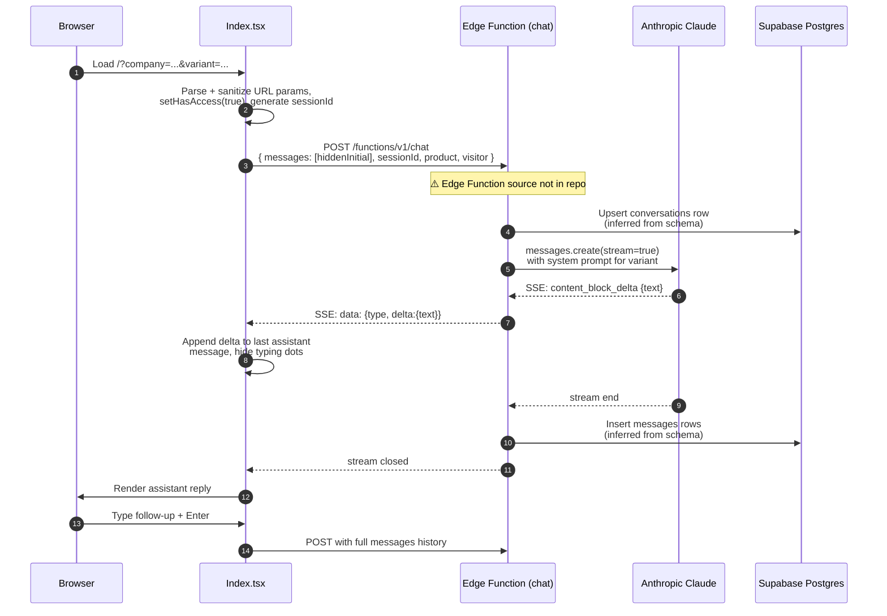

# 03 — Backend

## ⚠️ Source code not in repo

The frontend posts to:

```
POST https://mpbgzczhgwiplojqsaiy.supabase.co/functions/v1/chat
```

(referenced in `src/pages/Index.tsx:3`). However, **no `supabase/functions/chat/` directory exists in the repo** — only `supabase/config.toml` and `supabase/migrations/`. This means the deployed Edge Function source is managed outside this repository (or directly via the Supabase dashboard).

Everything below the "Request contract" section is either:
- **Observed** from the client-side request/response handling, or
- **Inferred** from database schema, configured secrets, and user-provided context (marked ⚠️).

A second Edge Function is implied by the schema (`bookings.followup_sent`, `bookings.reminder_sent`, `notification_log` table) but has no client-side reference and no source in repo. ⚠️ TO CONFIRM whether scheduled cron functions exist.

## Request contract (observed)

From `src/pages/Index.tsx:73-86`:

**Headers**
```
Content-Type: application/json
apikey:        <Supabase anon JWT>
Authorization: Bearer <Supabase anon JWT>
```

The anon key is hardcoded at `src/pages/Index.tsx:4` (and also at `src/integrations/supabase/client.ts:6`). See `06-SECURITY.md`.

**Body** (TypeScript shape inferred from the call site):

```ts
interface ChatRequest {
  messages: { role: "user" | "assistant"; content: string }[];
  sessionId: string;       // crypto.randomUUID() per page load
  product: string;         // sanitized slug, defaults to "lotmanager"
  visitor: {
    name: string;
    dealer: string;        // from ?company= or ?dealer=
    country: string;
    variant: string;       // "web1".."web3" or "1".."3"
  };
}
```

## Response contract (observed)

`Content-Type` is treated as a stream of SSE-style lines. The client (`Index.tsx:95-122`) does:

1. Read the body via `ReadableStream` reader.
2. Split on `\n`, keep the trailing partial in a buffer.
3. For each line beginning with `data: `, JSON-parse the rest.
4. If `data.type === "content_block_delta"` and `data.delta?.text` is truthy, append to the running assistant message.

This matches Anthropic's Messages API streaming event shape — strongly suggesting the Edge Function is a thin proxy that forwards Anthropic's stream verbatim (or near-verbatim).

## Conditional system prompts (web1/2/3 vs 1/2/3)

⚠️ **TO CONFIRM — not implementable from repo.** The user-supplied context describes:

- `variant=web1|web2|web3` → "turnkey pitch"
- `variant=1|2|3` → "software pitch"

The frontend forwards `visitor.variant` raw to the Edge Function (`Index.tsx:84`) and only branches locally to choose the channel word ("SMS" vs "email") in the hidden initial message (`Index.tsx:145`). All system-prompt selection therefore must happen inside the Edge Function. The `products.system_prompt` column (`text NOT NULL`) is the only obvious storage for prompt templates, but how variants compose with it is not visible from this codebase.

## Anthropic model

⚠️ **Not in repo.** Confirmed only that:

- `ANTHROPIC_API_KEY` exists as a Supabase secret.
- The streaming event names (`content_block_delta`) come from the Anthropic Messages API.

Specific model name (e.g. `claude-3-5-sonnet-...`) cannot be cited from this repo.

## Error handling and fallbacks (client side)

`src/pages/Index.tsx:124-134`:

```ts
} catch {
  setShowTyping(false);
  setMessages(prev => [...prev, {
    role: "assistant",
    content: "Sorry, I'm having a connection issue. Please refresh and try again.",
  }]);
} finally {
  setIsStreaming(false);
  setShowTyping(false);
  inputRef.current?.focus();
}
```

A non-OK HTTP response or missing body throws (`Index.tsx:88`) and falls through to the same fallback. There is **no retry**, no exponential backoff, and no surfaced error code.

⚠️ Edge Function-side error handling and rate limiting are not visible from this repo.

## CORS configuration

⚠️ **Not in repo.** Required since the browser calls the function cross-origin (`*.lovable.app` / `chat.getlotmanager.com` → `*.supabase.co`). Configuration must exist on the deployed Edge Function — not auditable here.

## Sequence diagram


