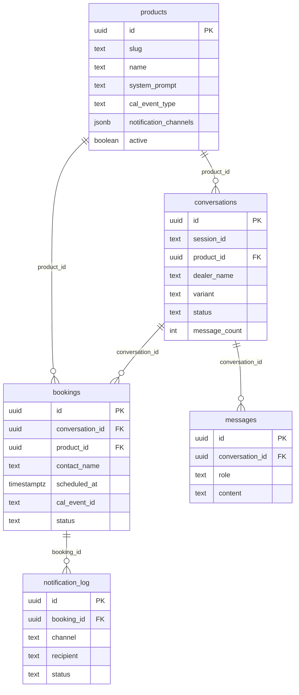

# 04 — Data Model

Source of truth: `src/integrations/supabase/types.ts` (auto-generated) and `supabase/migrations/`.

All tables live in the `public` schema. No tables reference `auth.users` — the chat is anonymous.

## Tables

### `products`
Defines a sellable product (e.g. LotManager) and its sales context.

| Column | Type | Nullable | Default |
|---|---|---|---|
| id | uuid | no | `gen_random_uuid()` |
| slug | text | no | — |
| name | text | no | — |
| owner_name | text | no | `'Wayne'` |
| owner_email | text | yes | — |
| owner_phone | text | yes | — |
| owner_whatsapp | text | yes | — |
| system_prompt | text | no | — |
| brochure_url | text | yes | — |
| cal_event_type | text | yes | — |
| notification_channels | jsonb | yes | `{email:{enabled:true}, slack:{enabled:false}, whatsapp:{enabled:true}}` |
| active | boolean | yes | `true` |
| created_at | timestamptz | yes | `now()` |
| updated_at | timestamptz | yes | `now()` |

### `conversations`
One row per chat session (one per page load).

| Column | Type | Nullable | Default |
|---|---|---|---|
| id | uuid | no | `gen_random_uuid()` |
| session_id | text | no | — (matches frontend `crypto.randomUUID()`) |
| product_id | uuid | yes | — |
| contact_name | text | yes | — |
| dealer_name | text | yes | — |
| country | text | yes | — |
| variant | text | yes | — (`web1`..`web3` or `1`..`3`) |
| language | text | yes | `'en'` |
| business_size | text | yes | — |
| current_tools | text | yes | — |
| primary_pain | text | yes | — |
| status | text | yes | `'active'` |
| message_count | integer | yes | `0` |
| started_at | timestamptz | yes | `now()` |
| last_message_at | timestamptz | yes | `now()` |
| ended_at | timestamptz | yes | — |
| demo_booked_at | timestamptz | yes | — |
| demo_cal_event_id | text | yes | — |

### `messages`
Per-turn transcript.

| Column | Type | Nullable | Default |
|---|---|---|---|
| id | uuid | no | `gen_random_uuid()` |
| conversation_id | uuid | yes | — (FK → `conversations.id`) |
| role | text | no | — (`user` / `assistant`) |
| content | text | no | — |
| created_at | timestamptz | yes | `now()` |

### `bookings`
Demos scheduled via Cal.com.

| Column | Type | Nullable | Default |
|---|---|---|---|
| id | uuid | no | `gen_random_uuid()` |
| conversation_id | uuid | yes | — (FK → `conversations.id`) |
| product_id | uuid | yes | — (FK → `products.id`) |
| contact_name | text | no | — |
| contact_phone | text | yes | — |
| contact_email | text | yes | — |
| dealer_name | text | yes | — |
| country | text | yes | — |
| cal_event_id | text | yes | — |
| scheduled_at | timestamptz | no | — |
| duration_minutes | integer | yes | `20` |
| pain_summary | text | yes | — |
| conversation_transcript_url | text | yes | — |
| status | text | yes | `'confirmed'` |
| reminder_sent | boolean | yes | `false` |
| followup_sent | boolean | yes | `false` |
| created_at | timestamptz | yes | `now()` |

### `notification_log`
Outbound notifications (email / WhatsApp / Slack) for bookings.

| Column | Type | Nullable | Default |
|---|---|---|---|
| id | uuid | no | `gen_random_uuid()` |
| booking_id | uuid | yes | — (FK → `bookings.id`) |
| channel | text | no | — |
| recipient | text | no | — |
| status | text | yes | `'sent'` |
| payload | jsonb | yes | — |
| error_message | text | yes | — |
| created_at | timestamptz | yes | `now()` |

## ERD



## Row-Level Security

Migration `supabase/migrations/20260415204830_*.sql` (re)creates one policy per table:

```sql
CREATE POLICY "Service role full access" ON public.<table>
  FOR ALL TO service_role USING (true) WITH CHECK (true);
```

Migration `supabase/migrations/20260415214011_*.sql` removes a previously permissive anon SELECT policy on `products`:

```sql
DROP POLICY IF EXISTS "Anon can read active products" ON public.products;
```

**Effect**: anon clients (the browser using the publishable key) cannot read or write any of these tables directly. All DB access flows through the Edge Function using `SUPABASE_SERVICE_ROLE_KEY`. This is consistent with the frontend, which never imports the Supabase client for the chat.

## Database functions and triggers

- `public.update_updated_at()` — `BEFORE UPDATE` trigger function that sets `NEW.updated_at = now()`. Defined in `supabase/migrations/20260415204830_*.sql:26-35` with `SET search_path = public`.
- ⚠️ No triggers are listed in the schema dump — TO CONFIRM whether `update_updated_at` is actually attached to `products` (the only table with `updated_at`).

## What gets logged

| Event | Where |
|---|---|
| Visitor session start | `conversations` row keyed by `session_id`; visitor params (`dealer_name`, `country`, `variant`, `contact_name`) populated from request body. |
| Conversation turn | `messages` row per user/assistant turn (`conversation_id` FK). |
| Variant attribution | `conversations.variant` text column. |
| Demo bookings | `bookings` row with `cal_event_id`, `scheduled_at`, contact details, optional `pain_summary` and transcript URL. |
| Notification dispatch | `notification_log` row per channel attempt (success or failure). |

⚠️ The actual write paths live in the Edge Function (not in repo); the columns above are present in the schema and are the obvious sinks.

## Retention

⚠️ No retention policy, TTL, or cron job found in the repo.
